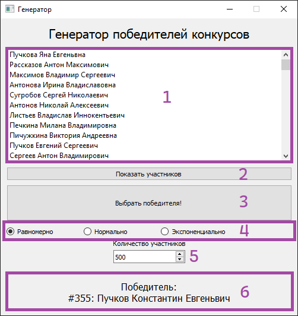
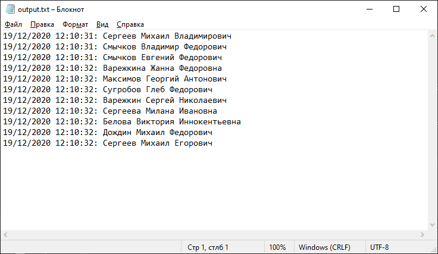

# Документация продукта Random

## Инструкция пользователя



Программа "Random" состоит из одного окна, которое содержит весь интерфейс программы. Интерфейс состоит из:
* списка участников конкурса (1);
* кнопки, формирующей список участников конкурса (2);
* кнопки, выбирающей победителя на основе сформированного списка (3);
* радио-кнопок, предоставляющих три вида распределений, с помощью которых происходит генерация случайного номера победителя (4);
* поля для выбора количества участников (5);
* области результата проведения конкурса (6).

По-умолчанию, кнопки (2) и (3) неактивны, так как зависят от наличия числа участников и выбранного способа генерации соответственно. Также, кнопка (3) останется неактивной в случае, если список участников не был выведен на экран.

Процесс работы с программой состоит из нескольих простых шагов, в соответствии с которыми необходимо:
1) Ввести количество участников конкурса;
2) Нажать на кнопку "Показать участников";
3) Выбрать вид распределения (равномерное, нормальное или экспоненциальное);
4) Нажать на кнопку "Выбрать победителя!".

Если изменить число участников и не вывести список заново, то программа будет продолжать генерировать победителя на основе предыдущего списка со старым количеством участников, поэтому кнопку (2) нужно нажимать каждый раз после взаимодействия с полем выбора (5).

После каждого нажатия кнопки (3) результат конкурса выводится в файл output.txt в формате "дата время: ФИО":



## Описание используемых программных модулей (библиотек)

Программа "Random" на фундаментальном уровне построена на библиотеках PyQt5 и Numpy: 

* PyQt5 - Python-библиотека, позволяющая строить кросс-платформенные графические приложения на базе Qt5. 
* Numpy - библиотека, содержащая огромный функционал для проведения математических вычислений и симуляций. В случае с "Random", на Numpy основывается генерация случайных чисел.

"Random" базируется на нескольких собственных модулях, разработанных с помощью вышеописанных библиотек:
* main.py - основной модуль, в котором реализовано окно и взаимодействие с его элементами (интерфейс программы, соответственно, содержится в файле main.ui в виде XML разметки);
* rand.py - модуль, содержащий три метода генерации случайных чисел;
* randomizer.py - вспомогательный модуль, генерирующий имена для списка участников на основе заранее подготовленных .txt списков в папке randomizer;
* exporter.py - вспомогательный модуль, добавляющий возможность экспортировать результаты конкурсов в файл output.txt.

### main

Содержит класс MainWindow (PyQt5.QtWidgets.QMainWindow), конструктор класса и функции, вызываемые при взаимодействии с элементами интерфейса (doTheMagic, onClicked, onValueChanged, goGet).

Функция onClicked проверяет, отлично ли количество участников от 0 и выбрана ли хотя бы одна радио-кнопка (вызывается также любой из радио-кнопок). Служит для того, чтобы кнопка "Выбрать победителя!" активировалась только при наличии двух описанных условий:

```python
def onClicked(self):

        global a
        if self.spinBox.value() > 0:
            if len(a) > 0: 
                if self.radioButton.isChecked() or self.radioButton_2.isChecked() or self.radioButton_3.isChecked():
                    self.pushButton_2.setEnabled(True)
```

Функция onValueChanged включает и выключает кнопку "Показать участников", основываясь на значении поля ввода количества участников; если число равно 0, кнопка выключена, в ином случае она активна:

```python
def onValueChanged(self):

        if self.spinBox.value() > 0:
            self.pushButton.setEnabled(True)
        else:
            self.pushButton.setEnabled(False)
```

Функция goGet создает список участников, пользуясь randomizer.py, а также заносит участников в список как элементы ListView из Qt5 (PyQt5.QtGui.QStandardItem):

```python
def goGet(self):

        global a
        a = randomizer.genList(self.spinBox.value())
        self.model = QtGui.QStandardItemModel()
        self.listView.setModel(self.model)
        for i in a:
            self.item = QtGui.QStandardItem(i)
            self.model.appendRow(self.item)
```

Функция doTheMagic вызывает генерацию случайного номера победителя (метод генерации проверяется тремя условиями, связанными с радио-кнопками), а также выводит победителя в нижней части программы и вызывает функцию экспорта в файл:

```python
def doTheMagic(self):

        global a
        if self.radioButton.isChecked():
            self.index = int(rand.even(0, self.spinBox.value()))
        if self.radioButton_2.isChecked():
            self.index = int(rand.normal(self.spinBox.value()))
        if self.radioButton_3.isChecked():
            self.index = int(rand.expo(self.spinBox.value()))
        self.label_4.setEnabled(True)
        self.name = a[self.index]
        self.label_4.setText('Победитель:\n' + '#' + str(self.index + 1) + ': ' + self.name)
        exporter.exportToFile(self.name)
```

### rand

Содержит три функции, соответствующие трем видам распределений, на основе которых генерируется случайное число:
* even - равномерное распределение
* normal - нормальное распределение
* expo - экспоненциальное распределение

Функция even принимает два параметра - min и max, которые соответствуют нижней и верхней границам величины случайного числа, причем параметр min при вызове функции из main всегда равен единице:

```python
def even(min, max):
    return float(r.random() * (max - min) + min)
```

Функции normal и expo принимают один параметр - lim, который фактически является верхним пределом величины случайного числа. 

normal сначала вычисляет порядок числа l, после чего генерирует одну случайную величину и умножает на 10 в степени порядка l. Это делается по той причине, что метод random.normal из Numpy генерирует слишком маленькие числа, которые нельзя использовать в качестве номера участника:

```python
def normal(lim):
    l = len(str(lim))
    norm = abs(random.normal(0, 0.5, 1))
    norm = int(norm * 10 ** l)
    if norm < lim:
        return norm
    else:
        return r.randint(0, lim - 1)
```
expo работает схожим образом, но вместо одной величины генерирует 100, затем берет первую величину, которая попадает под заданное пользователем условие верхнего предела:

```python
def expo(lim):
    power = len(str(lim))
    threshold = lim * 1/10 ** power
    pool = random.exponential(1, 100)

    for i in pool:
        if i < threshold:
            return int(i * 10 ** power)
```

### randomizer

Данный модуль считывает .txt списки из папки randomizer, преобразовывает их в шесть списков Python, а затем выполняет три функции:
* genMale - генерация мужских имен
* genFemale - генерация женских имен
* genList - склеивание результатов выполнения двух предыдущих функции и перемешивание элементов

В связи с тем, что данный модуль не является основным, каждая функция не будет описана подробно.

### exporter

Содержит единственную функцию с одним параметром a, который представляет из себя строку с полным именем победившего участника. Функция открывает файл output.txt для записи и вносит в него строку, созданную по следующему шаблону:

```python
datetime.now().strftime("%d/%m/%Y %H:%M:%S") + ": " + a + '\n'
```

Здесь datetime.now() - метод получения текущей даты и времени, а strftime - шаблон для вывода полученной информации. 


